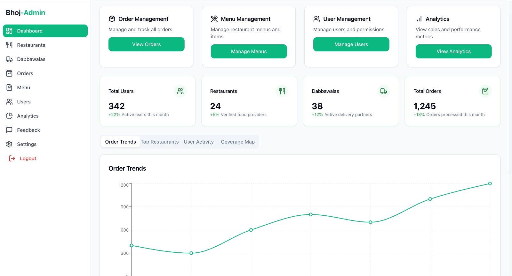
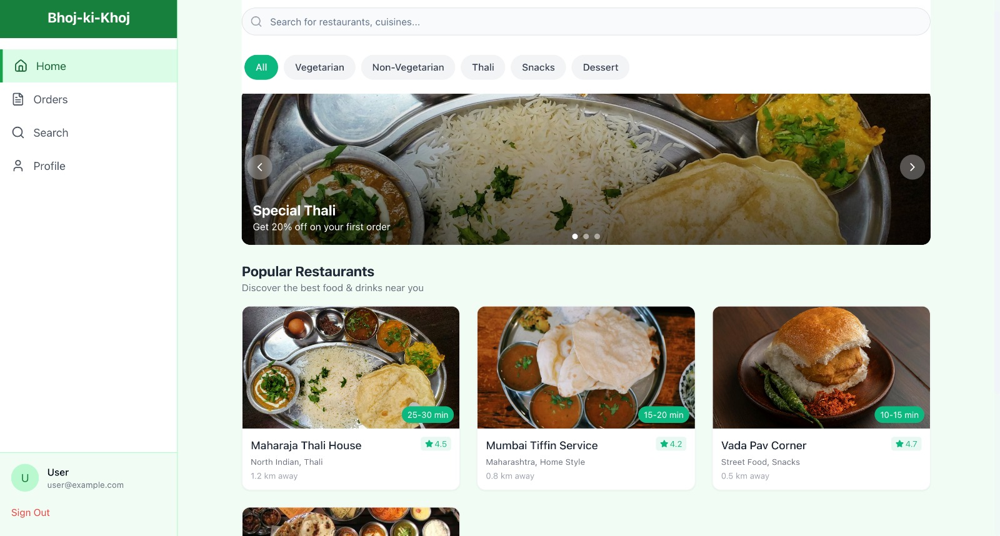
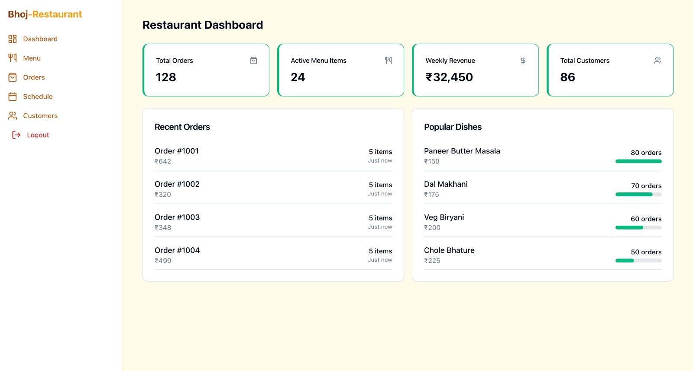
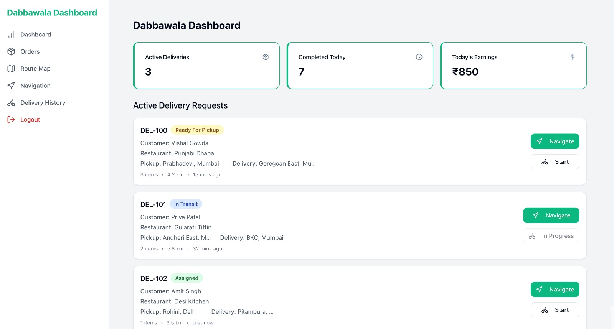
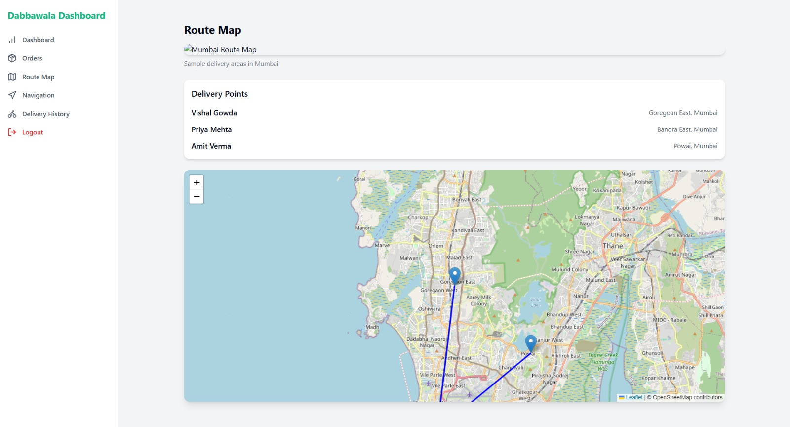
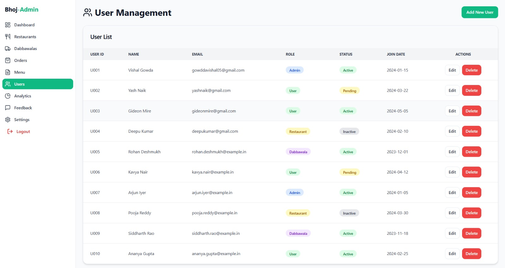
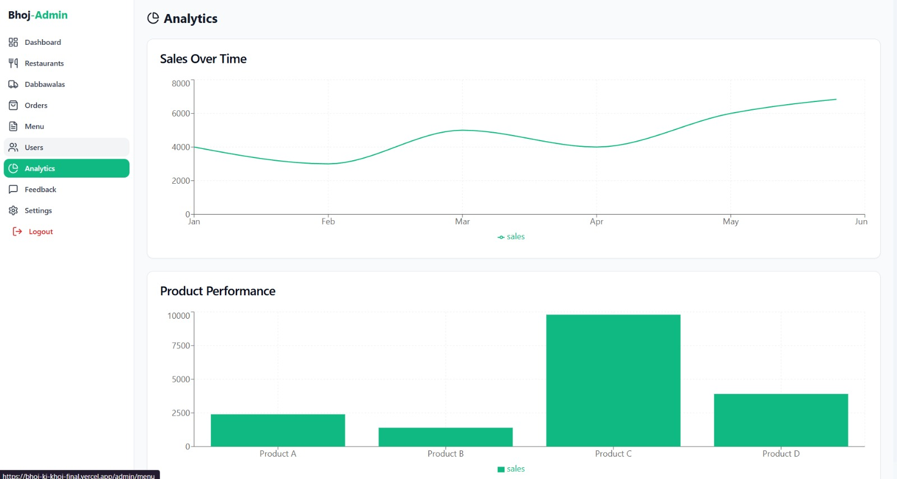
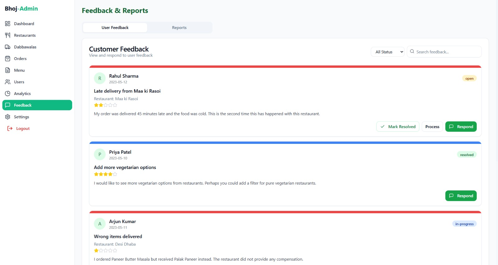

# 🍱 Bhoj-ki-Khoj – Community-Driven Food Delivery Platform

<div align="center">

**Healthy • Local • Affordable • Sustainable**

[]()
[]()
[]()

[]()
[]()
[]()
[]()

</div>

---

## 🎯 What is Bhoj-ki-Khoj?

**Bhoj-ki-Khoj** is a **web-based food delivery platform** that connects users with **home chefs and local food vendors**, inspired by the **Mumbai dabbawala model**.

Unlike mainstream food apps that promote fast food and large restaurants, Bhoj-ki-Khoj focuses on:

* **Healthy, hygienic home-style meals**
* **Empowering small food providers**
* **Low-cost, community-based delivery**
* **Sustainable and local consumption**

---

## ❗ Problem We Address

The current food delivery ecosystem is flawed:

* Focus on fast food over health
* High commission for small vendors
* No platform for home chefs
* Centralized delivery → high cost & pollution
* Poor transparency and community connect

This leaves **users, local vendors, and delivery workers underserved**.

---

## 💡 Our Solution

**Bhoj-ki-Khoj creates a decentralized, role-based food delivery system** that brings together:

* Users looking for home-cooked food
* Local kitchens & small restaurants
* Dabbawala-style delivery partners
* Admin-controlled quality & analytics

All managed through a **single, scalable digital platform**.

---

## 👥 User Roles & Capabilities

### 🧑 User

* Browse nearby home chefs & restaurants
* Search by cuisine, food type, distance
* Place orders & track delivery in real time
* Manage profile & order history

### 🍳 Restaurant / Home Chef

* Dashboard with order insights
* Menu & availability management
* Order acceptance & scheduling
* Customer overview

### 🚲 Dabbawala (Delivery Partner)

* Delivery dashboard
* Assigned orders & live status
* Route map & navigation
* Delivery history & earnings

### 🛠️ Admin

* Platform dashboard
* User, restaurant & dabbawala management
* Order monitoring
* Analytics & feedback handling

---

## 🖼️ Screenshots

### 🛠️ Admin Dashboard



### 🧑 User Home Page



### 🍳 Restaurant Dashboard



### 🚲 Dabbawala Dashboard



### 🗺️ Dabbawala Route Map & Navigation



### 👥 Admin – User Management



### 📊 Admin – Analytics



### 💬 Admin – Feedback & Reports



---

## ⚙️ Tech Stack (Why We Chose It)

| Layer    | Technology            | Reason                        |
| -------- | --------------------- | ----------------------------- |
| Frontend | React.js              | Fast, responsive, scalable UI |
| Auth     | Firebase              | Secure role-based login       |
| Database | Supabase (PostgreSQL) | Real-time data & scalability  |
| Maps     | Maps API              | Routing & live tracking       |
| Hosting  | Vercel                | Fast global deployment        |

🔹 Clean separation of concerns
🔹 Easy future scaling
🔹 Hackathon-ready & production-friendly

---

## 🧠 Innovation & USP

* **Home-chef first platform** (not restaurant-first)
* **Dabbawala-inspired delivery model**
* **Low-commission system for vendors**
* **Health-focused food discovery**
* **Strong admin governance & transparency**

👉 No mainstream food delivery app currently combines all of these.

---

## ⚖️ Comparison with Existing Platforms

| Feature               | Swiggy / Zomato | Bhoj-ki-Khoj |
| --------------------- | --------------- | ------------ |
| Home chefs            | ❌               | ✅            |
| Healthy focus         | ❌               | ✅            |
| Low vendor commission | ❌               | ✅            |
| Community delivery    | ❌               | ✅            |
| SDG alignment         | ❌               | ✅            |

---

## 🌍 SDG Alignment

* **SDG 3** – Good Health & Well-Being
* **SDG 8** – Decent Work & Economic Growth
* **SDG 12** – Responsible Consumption & Production
* **SDG 11** – Sustainable Cities & Communities

---

## ⚙️ Installation & Run Instructions

### Prerequisites

* Node.js (v18+)
* npm / yarn
* Modern browser
* Internet connection

### Steps

```bash
# Clone the repository
git clone https://github.com/your-username/bhoj-ki-khoj.git

# Move into project directory
cd bhoj-ki-khoj

# Install dependencies
npm install

# Run development server
npm run dev
```

🔐 **API keys are stored securely using environment variables and are not committed to the repository.**

---

## 📈 Feasibility & Scalability

* Built using open-source & cloud tools
* Works on **Android, iOS & Desktop browsers**
* Minimal hardware requirements
* Easily extendable to mobile apps & AI features

---

## 🚀 Future Scope

* Native Android & iOS apps
* AI-based food recommendations
* Subscription tiffin plans
* Carbon footprint tracking
* Multilingual support

---

## 👨‍💻 Team Members

* **Deepkumar Das**
* **Vishal Gowda**
* **Yash Naik**
* **Pranav Shirke**
* **Gideon Mire**

---

## 🏆 Why Bhoj-ki-Khoj Fits Open Innovation

✔ Solves a real-world local problem
✔ Strong social + economic impact
✔ Clear innovation & USP
✔ Technically sound & scalable
✔ Ready for real deployment

---

## 📜 Note

Developed for **academic and hackathon purposes**.
